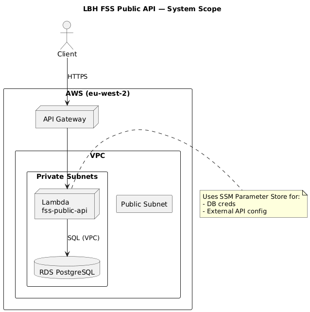
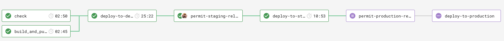

# LBH Find Support Services Public API
[](https://sonarcloud.io/summary/new_code?id=LBHackney-IT_lbh-fss-public-api) [](https://sonarcloud.io/summary/new_code?id=LBHackney-IT_lbh-fss-public-api) [](https://sonarcloud.io/summary/new_code?id=LBHackney-IT_lbh-fss-public-api) [](https://sonarcloud.io/summary/new_code?id=LBHackney-IT_lbh-fss-public-api) [](https://sonarcloud.io/summary/new_code?id=LBHackney-IT_lbh-fss-public-api) [](https://sonarcloud.io/summary/new_code?id=LBHackney-IT_lbh-fss-public-api) [](https://sonarcloud.io/summary/new_code?id=LBHackney-IT_lbh-fss-public-api) [](https://sonarcloud.io/summary/new_code?id=LBHackney-IT_lbh-fss-public-api)

Find Support Services Public API is a service that exposes endpoints to allow consumers to search for support services available to Hackney residents.

### Runtime (AWS)
- **API Gateway** → **Lambda (.NET 8)** → **RDS PostgreSQL** (in VPC private subnets).
- Lambda runs in a **VPC** with **security groups** and **private subnets** configured per environment.
- Configuration and secrets are stored in **SSM Parameter Store**.

### Infrastructure as Code
- **Terraform** defines environment infrastructure in:
  - `terraform/development`
  - `terraform/staging`
  - `terraform/production`
- **RDS PostgreSQL** is provisioned via a shared Terraform module.
- Terraform state is stored in **S3**.



## Stack

- .NET 8 (AWS Lambda)
- nUnit
- Serverless Framework
- Terraform
- CircleCI

## Contributing

### Local Development

1. **Prerequisites**: Docker Desktop installed
2. **Run the API**:
   ```sh
   make build && make serve
   ```
3. **Run tests**:
   ```sh
   make test
   ```
4. **Access**: API available at `http://localhost:3000`

### Deployment (Serverless)

The Lambda is deployed with Serverless. The function is defined in `LBHFSSPublicAPI/serverless.yml` and uses SSM parameters for configuration:

- `/fss-public-api/{stage}/postgres-*`
- `/fss-public-api/{stage}/addresses-api-*`
- `/fss-common-api/{stage}/addresses-api-token`
- `/fss-common-api/{stage}/placeholder-image`

### Infrastructure (Terraform)

Terraform is environment-scoped:
- `terraform/development`
- `terraform/staging`
- `terraform/production`

Use CircleCI workflows to **plan/apply** Terraform (see below).

### CI/CD (CircleCI)

CircleCI workflows:
- **feature**: format, tests, and **Terraform plan** for all envs.
- **check-and-deploy-development**: auto deploy to **development** on `develop`.
- **check-and-deploy-staging-and-production**: gated deploys to **staging** and **production** on `master`.
- **terraform-release**: gated **Terraform apply** per environment.

Database migrations run in CircleCI via an SSM jump box before deployments.

### Release process

We use a pull request workflow, where changes are made on a branch and approved by one or more other maintainers before the developer can merge into `master` branch.



Then we have an automated six step deployment process, which runs in CircleCI.

1. Automated tests (nUnit) and code checks (Sonar) are run to ensure the release is of good quality.
2. The application is deployed to development automatically, where we check our latest changes work well.
3. We manually confirm a staging deployment in the CircleCI workflow once we're happy with our changes in development.
4. The application is deployed to staging.
5. We manually confirm a production deployment in the CircleCI workflow once we're happy with our changes in staging.
6. The application is deployed to production.

Our environments are hosted by AWS. We would deploy to production per each feature/config merged into  `master`  branch.

## Static Code Analysis

### Using [FxCop Analysers](https://www.nuget.org/packages/Microsoft.CodeAnalysis.FxCopAnalyzers)

FxCop runs code analysis when the Solution is built.

Both the API and Test projects have been set up to **treat all warnings from the code analysis as errors** and therefore, fail the build.

However, we can select which errors to suppress by setting the severity of the responsible rule to none, e.g `dotnet_analyzer_diagnostic.<Category-or-RuleId>.severity = none`, within the `.editorconfig` file.
Documentation on how to do this can be found [here](https://docs.microsoft.com/en-us/visualstudio/code-quality/use-roslyn-analyzers?view=vs-2019).

## Adding a migration

For this API we have a database in RDS, we are using EF Core Code first migrations to manage the schema for this database.
To make changes to the database structure follow these steps.

1. If you haven't done so previously, you need to install the [dotnet ef cli tool](https://docs.microsoft.com/en-us/ef/core/miscellaneous/cli/dotnet) by running `dotnet tool install --global dotnet-ef`.
2. Make the necessary changes to the database model in the code, namely in `DatabaseContext` or any of the DbSet's listed in the file.
3. In your terminal navigate to the project root folder and run `dotnet ef migrations add -o ./V1/Infrastructure/Migrations -p LBHFSSPublicAPI [NameOfThisMigration]` to create the migration files. NameOfThisMigration should be replaced with your migration name e.g. AddColumnNameToPeopleTable.
4. Go to the folder /LBHFSSPublicAPI/V1/Infrastructure/Migrations and you should see two new files for the migration. In the one which doesn't end in `.Designer` you can check through the migration script to make sure everything is being created as you expect.
5. If the migration file looks wrong or you have missed something, you can either run `CONNECTION_STRING="Host=127.0.0.1;Database=testdb;Username=postgres;Password=mypassword;" dotnet ef migrations remove -p LBHFSSPublicAPI` with the database in the connection string running or just delete the migration files and revert the changes to `DatabaseContextModelSnapshot.cs`. Make the necessary changes to the context, then create the migration files again.
6. The CircleCI [configuration file](https://github.com/LBHackney-IT/lbh-fss-public-api/blob/master/.circleci/config.yml) has been set up to run any new migrations to the specified AWS RDS database prior to deploying the API.

Note: You must not change any DbSet that is listed in `DatabaseContext` without creating a migration as the change then won't be reflected in the database and will cause errors.


## Testing

### Run the tests

```sh
$ make test
```

To run database tests locally (e.g. via Visual Studio) the `CONNECTION_STRING` environment variable will need to be populated with:

`Host=localhost;Database=testdb;Username=postgres;Password=mypassword"`

Note: The Host name needs to be the name of the stub database docker-compose service, in order to run tests via Docker.

### Agreed Testing Approach
- Use nUnit, FluentAssertions and Moq
- Always follow a TDD approach
- Tests should be independent of each other
- Gateway tests should interact with a real test instance of the database
- Test coverage should never go down
- All use cases should be covered by E2E tests
- Optimise when test run speed starts to hinder development
- Unit tests and E2E tests should run in CI
- Test database schemas should match up with production database schema
- Have integration tests which test from the PostgreSQL database to API Gateway

## Data Migrations
### A good data migration
- Record failure logs
- Automated
- Reliable
- As close to real time as possible
- Observable monitoring in place
- Should not affect any existing databases

## Contacts

### Active Maintainers

- **Selwyn Preston**, Head of Engineering at London Borough of Hackney (selwyn.preston@hackney.gov.uk)

### Other Contacts

[docker-download]: https://www.docker.com/products/docker-desktop/
[made-tech]: https://madetech.com/
[AWS-CLI]: https://aws.amazon.com/cli/

# License

[MIT](./LICENSE)
